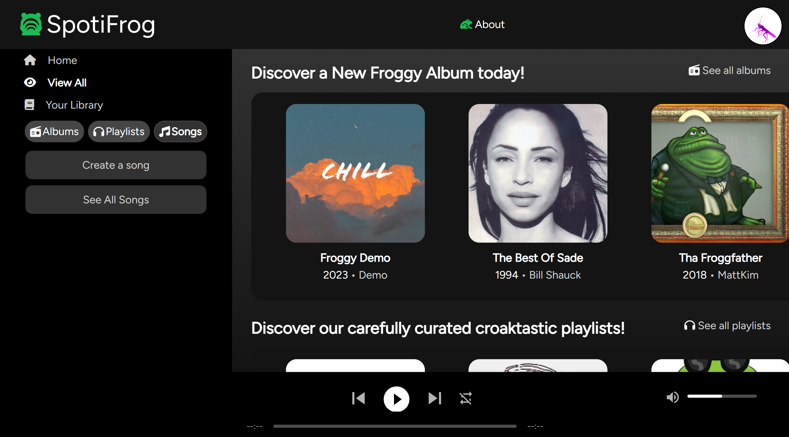
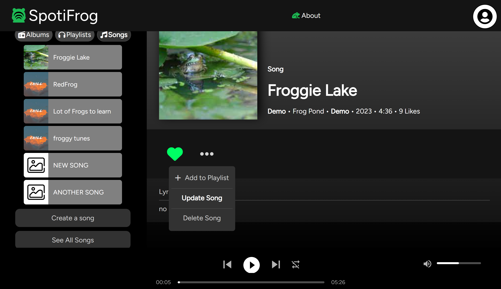
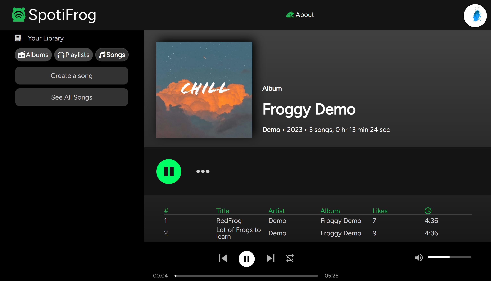

# SpotiFrog
A frog-themed digital music service that gives you access to songs from artists all over the world.

## Technologies Used

## Live URL for Spotifrog
https://spotifrog2.onrender.com/

## Screenshot teases

### Landing Page

On the main page, we see the Navigation area in the upper left, the Library area beneath it, the main view showing examples of albums and playlist with cover art in the middle and right.

### Interacting with a Song

Here we see a selected Song and a menu allowing you to delete or edit the Song.

### Listening to great Music

Finally, we see a shot of someone enjoying the playback of music that has been uploaded.

## Wiki

Check out our Wiki for site background, features, stories, DB schema, Redux store layout, APIs, details on tech, and more!

https://github.com/MattKim97/SpotiFrog/wiki

### Front-end

*  React
    - Components:
    - Packages:
*  Redux
*  JavaScript
*  CSS
*  HTML
*  Icons
    - FontAwesome
    - GoogleFonts API (Figtree)

### Back-end

*  Python
*  SQL
*  SQLAlchemy
*  Alembic
*  Sqlite3 (development)
*  PostGreSQL (production)
*  Amazon Web Services (AWS)
*  Flask
*  Packages:
*  Docker

### Tools
* VS Code
* GitHub and Git
* Render for deployment and publishing

## Installation Instructions

### Back-end

* Decide on database / ORM; we used SQLAlchemy/Sqlite-developemtn; flask-sqlalchemy-alembic/PostGreSQL-production and AWS for large files (media/pictures/art)...for these instructions we'll assume you follow in our footsteps!
* Install packages needed, and dependencies on any other packages
    - pipenv -r install requirements.txt
* create a .env file with appropriate environment variable settings (see .env.example for values)
* if you use PostGreSQL, you will need to set a SCHEMA= variable to a snake_cased name for full table qualifying
* set up seed values in app/seeds
* then setup the database, migrate tables, and seed them

### Front-end

* Follow the README in react-app/ !!

## Authors

## Bill Shauck 🐸 

## Sophia Tsau 🐸 

## Matthew Kim 🐸 
