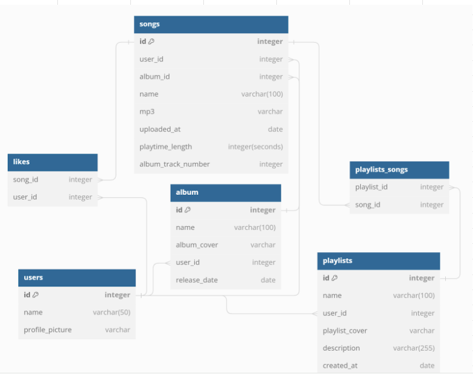

# SpotiFrog
A frog-themed music-sharing platform

Welcome to "Spotifrog," where every hop is a musical leap!

This isn't just another tadpole in the pond of music streaming sites; it's a fully-grown, ribbet-rocking platform.

Imagine a world where bullfrogs belt out the blues, and tree frogs trill the top charts.

Our users don't just play music; they leap onto a lily pad of lyrical landscapes.

Uploading songs is as easy as a frog catching flies – simply hop onto the platform, croak out your tunes, and watch as your music ripples across the pond.

With Spotifrog, every artist can have their moment in the swamp-light, whether they're a croaking classicist or a poison dart performer.

So, tune in, turn up the volume, and let the amphibious anthems amphibi-rock your world! 🐸

## Live URL for Spotifrog
https://spotifrog2.onrender.com/

## Database Schema Design

## Feature List

### 1. Login/Logout/Demo

* Visitors can sign-up as a user
* Visitors can use a demo log in to try the site.
* Visitors may play and listen to songs without logging in to a user
* Visitors may not create or upload songs without logging in to a user
* Visitors may not create or upload songs to a playlist without logging in to a user
* Visitors may not create or upload songs to an album without logging in to a user
* Visitors may not like songs without logging in to a user
* Users may log-in and log-out
* Users when logging in, redirects to the last page logged out from if not new, if new redirect to landing page

### 2. Songs

* Users should be able to view all Songs
* Users should be able to upload their Songs
* Users should be able to update their Song's details only
* Users should be able to delete their Songs only

### 3. Likes

* Users are able to like a song
* Users are not able to like a song more than once
* Users are able to unlike a song
* Users are not able to unlike a song that they have not liked
* Visitors and Users are able to see how many likes each song has

### 4. Albums
*  Users are able to create an album
*  Users are only allowed to add songs that they uploaded to their albums
*  Users are not able to add songs to albums that they do not own
*  Users are not able to delete songs from albums that they do not own
*  Visitors and Users should be able to see all albums
*  Users should be able to delete their own albums
*  Users are not able to delete albums that they do not own

### 5. Playlists
* Users are able to create an playlist
* Users are able to update a playlist's details
* Users are not able to add songs to playlists they do not own
* Users are not able to delete songs from playlists they do not own
* Visitors should be able to see all playlists
* Users should be able to delete their own playlists
* Users are not able to delete playlists they do not own

## User Stories

### Sign-up

* As an unregistered and unauthorized user, I want to be able to sign up for the website via a sign-up form.
* When I'm on the `/signup` page:
* I would like to be able to enter my email, username, and preferred password on a clearly laid out form.
* I would like the website to log me in upon successful completion of the sign-up form; so I may seamlessly access the site's functionality
* When I enter invalid data on the sign-up form:
    - I would like the website to inform me of the validations I failed to pass, and repopulate the form with my valid entries (except my password).
    - So that I can try again without needing to refill forms I entered valid data into.

### Log in

* As a registered and unauthorized user, I want to be able to log in to the website via a log-in form.
* When I'm on the `/login` page:
* I would like to be able to enter my email and password on a clearly laid out form.
* I would like the website to log me in upon successful completion of the log-in form; so I may seamlessly access the site's functionality
* When I enter invalid data on the log-in form:
* I would like the website to inform me of the validations I failed to pass, and repopulate the form with my valid entries (except my password).
* So that I can try again without needing to refill forms I entered valid data into.

### Demo User

* As an unregistered and unauthorized user, I would like an easy-to-find and clear button on the `/login` page to allow me to visit the site as a guest without needing to sign up or have an official login.
* When I'm on the `/login` page:
* I can click on a Demo User button to log me in and allow me access as a normal user.
* So I may test the site's features and functionality without needing to stop and enter credentials.

### Log Out

* As a logged-in user, I want to log out via an easy-to-find log out button on the navigation bar.
* While on any page of the site:
* I can log out of my account and be redirected to the Spotifrog landing page
* So I may easily log out to keep my information secure.

### Songs

* As a unlogged-in visitor, I should also be able to view a list of all Songs available on the platform, so I can discover new music
* As a logged-in user I want to upload Songs that I created, to share my music with the community
* As a logged-in user I want to be able to update the details of the Songs I have created and uploaded (name, lyrics)
* As a logged-in user I want the ability to delete the songs that I own, if I no longer wish to have them on the platform

### Likes
* As a logged-in user I want to be able to like a song, to show appreciation
* As a logged-in user I want to be able to like a song only once in order to maintain fairness
* As a logged-in user I want to be able to unlike a song if I don't like the song anymore, or if I accidentally liked the song
* As a logged-in user I want to be restricted from unliking a song that I have not previously liked before
* As a logged-in user I want to see the total number of likes each song has, in order to see its popularity among the users of the site

### Albums
* As a logged-in user I want to be able to create an album to organize and showcase a collection of my uploaded songs
* As a logged-in user I want to add only the songs I have uploaded to my albums
* As a logged-in user I want to be restricted from adding songs to albums that I do not own
* As a logged-in user I want to be restricted from deleting songs from albums that I do not own
* As a logged-in user I want Visitors to see a list of all albums, including mine , in-order to promote discoverability
* As a logged-in user I want to be able to delete my own albums
* As a logged-in user I want to be restricted from deleting albums that I do not own

### Playlists
* As a logged-in user I want to create a playlist of my favorite songs
* As a logged-in user I want to update the details of my playlists when I feel like
* As a logged-in user I want to be restricted from adding songs to playlists I do not own
* As a logged-in user I want to be restricted from deleting songs from playlists I do not own
* As a logged-in user I want Visitors to see a list of all playlists including mine, in order to share my musical taste
* As a logged-in user I want to be able to delete my own playlists
* As a logged-in user I want to be restricted from deleting playlists that I do not own

## Technologies Used

### Front-end

*  React
    - Components:
    - Packages:
*  Redux
*  JavaScript
*  CSS
*  HTML
*  Icons
    - FontAwesome
    -

### Back-end

*  Python
*  SQLAlchemy
*  Alembic
*  Sqlite3 (development)
*  PostGreSQL (production)
*  Amazon Web Services (AWS)
*  Flask
*  Packages:
*  Docker

## Frameworks

### Front-end API

### Back-end API

All back-end routes begin with "/api". All Models returned are transformed into dictionaries (the equivalent of JS POJO).

* User

User routes begin with "/api/users"
    ** "/api/users/" GET
        * returns a list of all users
    ** "/api/users/<int:id>" GET
        * returns the user that matches the id
    ** "/api/users/<int:id>/albums' GET
        * returns all albums of a given user
    ** "/api/users/<int:id>/playlists' GET
        * returns all playlists of a given user
    ** "/api/users/<int:id>/songs" GET
        * returns all songs of a given user

* Songs

Song routes begin with "/api/songs"
    ** "/api/songs/" GET
        returns all songs

@song_routes.route('/')
def get_all_songs():
    """
    Query for all songs and returns them in a list of song dictionaries
    """
    songs = Song.query.all()
    return {"songs": [song.to_dict() for song in songs]}

@song_routes.route('/<int:id>')
def get_song(id):
    """
    Query for a song by id and returns that song in a dictionary
    """
    song = Song.query.get(id)
    return song.to_dict(scope="detailed")

@song_routes.route('/new', methods=['POST'])
@login_required
def create_song():
    """
    Creates a new song and returns the new song in a dictionary
    """

    form = SongForm()

    form['csrf_token'].data = request.cookies['csrf_token']

    mp3_data = request.files['mp3'].read()

    if form.validate_on_submit():
        mp3 = form.mp3.data
        mp3.filename = get_unique_filename(mp3.filename)
        upload = upload_file_to_s3(mp3)

        if "url" not in upload:
            return upload, 401

        if not form.albumId.data or form.albumId.data == "0":
            new_song = {
            "userId": current_user.id,
            "albumId": None,
            "name": form.name.data,
            "mp3": upload["url"],
            "lyrics": form.lyrics.data,
        }
        else:
            new_song = {
                "userId": current_user.id,
                "albumId": form.albumId.data,
                "name": form.name.data,
                "mp3": upload["url"],
                "lyrics": form.lyrics.data,
            }
        new_song["playtimeLength"] = analyzePlayTime(mp3_data)
        if new_song["albumId"]:
            album = Album.query.get(new_song["albumId"])
            new_song["albumTrackNumber"] = len(album.songs) + 1

        song = Song(**new_song)
        db.session.add(song)
        db.session.commit()
        return song.to_dict(), 201
    elif form.errors:
        return error_messages(form.errors), 401
    else:
        return error_message("unknown", "An unknown Error has occurred"), 500

@song_routes.route('/<int:id>', methods=['PUT'])
@login_required
def update_song(id):

    """
    Updates a song and returns the updated song in a dictionary
    """

    song = Song.query.get(id)

    if song.userId != current_user.id:
        return error_message("user","Unauthorized"), 403

    form = UpdateSongForm()
    album_ids = [album.id for album in current_user.albums]

    if form.albumId.data is not None and form.albumId.data not in album_ids:
        return error_message("album", "Invalid Album"), 401

    form['csrf_token'].data = request.cookies['csrf_token']

    if form.validate_on_submit():
        song.name = form.name.data
        song.albumId = form.albumId.data
        song.lyrics = form.lyrics.data
        db.session.commit()
        return song.to_dict(), 201
    elif form.errors:
        return error_messages(form.errors), 401
    else:
        return error_message("unknown", "An unknown Error has occurred"), 500

@song_routes.route('/<int:id>', methods=['DELETE'])
@login_required
def delete_song(id):
    """
    Deletes a song and returns the id of the deleted song
    """
    song = Song.query.get(id)

    if song.userId != current_user.id:
        return error_message("user","Unauthorized"), 403

    file_to_delete = remove_file_from_s3(song.mp3)

    if file_to_delete is True:
        db.session.delete(song)
        db.session.commit()
        return {"message": "Song successfully deleted"}
    else:
        return error_message("file","File deletion error"), 401

@song_routes.route('/<int:songId>/likes', methods=["POST"])
@login_required
def like_song(songId):
    """
    Likes a song, creating relationship between user and song
    """
    song = Song.query.get(songId) # TODO could just get from current_user.songs

    if song is None:
        return error_message("song", "Song not found"), 404
    elif song in current_user.songsLiked:
        return error_message("like", "Cannot like a song that is already liked"), 401
    else:
        current_user.songsLiked.append(song)
        db.session.commit()
        return {"message": "Song successfully liked"}, 201

@song_routes.route('/<int:songId>/likes', methods=["DELETE"])
@login_required
def unlike_song(songId):
    """
    Unlikes a song, removing relationship between user and song
    """
    song = Song.query.get(songId) # TODO could just get from current_user.songs

    if song is None:
        return error_message("song", "Song not found"), 404
    elif song in current_user.songsLiked:
        current_user.songsLiked.remove(song)
        db.session.commit()
        return {"message": "Song successfully unliked"}, 200
    else:
        return error_message("like","Cannot unlike this song"), 401

* Playlists

@playlist_routes.route('/')
def get_all_playlist():
    playlists = Playlist.query.all()
    return {"playlists": [playlist.to_dict(scope="songs_details") for playlist in playlists]}

@playlist_routes.route('/<int:id>')
def get_playlist(id):
    playlist = Playlist.query.get(id)
    return playlist.to_dict(scope="songs_details")

@playlist_routes.route('/new', methods=["POST"])
@login_required
def create_playlist():

    """
    Creates a new playlist and returns the new playlist in a dictionary
    """

    form = PlayListForm()

    form['csrf_token'].data = request.cookies['csrf_token']

    if form.validate_on_submit():

        new_playlist = {
            "userId": current_user.id,
            "name": form.name.data,
            "description": form.description.data,
        }

        if form.playlistCover.data:

            image = form.playlistCover.data
            image.filename = get_unique_filename(image.filename)
            upload = upload_file_to_s3(image)

            if "url" not in upload:
                return upload, 401

            new_playlist["playlistCover"] = upload["url"]

        playlist = Playlist(**new_playlist)
        db.session.add(playlist)
        db.session.commit()
        return playlist.to_dict(), 201
    elif form.errors:
        return error_messages(form.errors), 401
    else:
        return error_message("unknown","Unknown error occurred"),500

"""NOT FULLY IMPLEMENTED ROUTE"""
@playlist_routes.route('/<int:id>', methods=["PUT"])
@login_required
def update_playlist(id):
    """
    Updates a playlist and returns the updated playlist in a dictionary
    """
    playlist = Playlist.query.get(id) # TODO just get from current_user

    form = PlayListForm()

    if playlist.userId != current_user.id:
        return error_message("user", "Authorization Error"), 403

    form['csrf_token'].data = request.cookies['csrf_token']
    if form.validate_on_submit():

        if form.playlistCover.data is not None:
            image = form.playlistCover.data
            image.filename = get_unique_filename(image.filename)
            upload = upload_file_to_s3(image)

            if "url" not in upload:
                return upload, 401

            remove_file_from_s3(playlist.playlistCover)
            playlist.playlistCover = upload["url"]

        playlist.name = form.name.data
        playlist.description = form.description.data
        db.session.commit()
        return playlist.to_dict(), 201
    elif form.errors:
        return error_messages(form.errors), 401
    else:
        return error_message("unknown","Unknown error occurred"),500

@playlist_routes.route('/<int:playlistId>/songs/<int:songId>', methods=["PUT", "PATCH"]) # change PATCH to DELETE?
@login_required
def add_song(playlistId, songId):
    """
    Adds or removes a song to an playlist and returns the updated playlist in a dictionary
    """

    song = Song.query.get(songId) # these two db hits can also just be gotten from current_user
    playlist = Playlist.query.get(playlistId)

    if song:
        if request.method =="PUT":
            if playlist in song.playlist:
                return error_message("song","Cannot add song to playlist again"), 401
            song.playlist.append(playlist)
        else:
            if playlist in song.playlist:
                song.playlist.remove(playlist)
            else:
                return error_message("song", "Song does not exist in playlist"), 403
        db.session.add(song)
        db.session.commit()
        return playlist.to_dict(scope="songs_details"), 200
    else:
        return error_message("song", "Invalid songId"), 403

@playlist_routes.route('/<int:playlistId>/', methods=["DELETE"])
@login_required
def delete_playlist(playlistId):
    """
    Deletes a playlist and returns the deleted playlist in a dictionary
    """
    playlist = Playlist.query.get(playlistId) # TODO just get from current_user

    if playlist.userId != current_user.id:
        return error_message("user", "Authorization Error"), 403

    if playlist.playlistCover is not None:
        file_to_delete = remove_file_from_s3(playlist.playlistCover)

        if file_to_delete is True:
            db.session.delete(playlist)
            db.session.commit()
            return {"message": "Playlist successfully deleted"}

        else:
            return error_message("file","File deletion error"), 401
    else:
        db.session.delete(playlist)
        db.session.commit()
        return {"message": "Playlist successfully deleted"}

* AUTH

def validation_errors_to_error_messages(validation_errors):
    """
    Simple function that turns the WTForms validation errors into a simple list
    """
    errorMessages = []
    for field in validation_errors:
        for error in validation_errors[field]:
            errorMessages.append(f'{field} : {error}')
    return errorMessages

@auth_routes.route('/')
def authenticate():
    """
    Authenticates a user.
    """
    if current_user.is_authenticated:
        return current_user.to_dict()
    return error_message("user","Unauthorized"), 403

@auth_routes.route('/login', methods=['POST'])
def login():
    """
    Logs a user in
    """
    form = LoginForm()
    # Get the csrf_token from the request cookie and put it into the
    # form manually to validate_on_submit can be used
    form['csrf_token'].data = request.cookies['csrf_token']
    if form.validate_on_submit():
        # Add the user to the session, we are logged in!
        user = User.query.filter(User.email == form.data['email']).first()
        login_user(user)
        return user.to_dict()
    return error_messages(form.errors), 401

@auth_routes.route('/logout')
def logout():
    """
    Logs a user out
    """
    logout_user()
    return {'message': 'User logged out'}

@auth_routes.route('/signup', methods=['POST'])
def sign_up():
    """
    Creates a new user and logs them in
    """
    form = SignUpForm()
    form['csrf_token'].data = request.cookies['csrf_token']
    if form.validate_on_submit():
        # add profilePictureUrl
        user_data = dict(
            username=form.data['username'],
            email=form.data['email'],
            password=form.data['password'],
        )

        if form.data["profilePicture"]:
            image = form.profilePicture.data
            image.filename = get_unique_filename(image.filename)
            upload = upload_file_to_s3(image)

            if "url" not in upload:
                return error_messages({"profilePicture": upload["errors"]}), 401

            user_data["profilePictureUrl"] = upload["url"]

        user = User(**user_data)
        db.session.add(user)
        db.session.commit()
        login_user(user)
        return user.to_dict()
    return error_messages(form.errors), 401

@auth_routes.route('/unauthorized')
def unauthorized():
    """
    Returns unauthorized JSON when flask-login authentication fails
    """
    return error_message("user","Unauthorized"), 403

* Albums

@album_routes.route('/')
def get_all_album():
    """
    Query for all albums and returns them in a list of album dictionaries
    """
    albums = Album.query.all()
    return {"albums": [album.to_dict() for album in albums]}

@album_routes.route('/<int:id>')
def get_album(id):
    """
    Query for a album by id and returns that album in a dictionary
    """
    album = Album.query.get(id)
    return album.to_dict(scope="songs_details")

@album_routes.route('/new', methods=["POST"])
@login_required
def create_album():
    """
    Creates a new album and returns the new album in a dictionary
    """

    form = AlbumForm()

    form['csrf_token'].data = request.cookies['csrf_token']

    if form.validate_on_submit():

        new_album = {
            "userId": current_user.id,
            "name": form.name.data,
            "releaseDate": form.releaseDate.data,
        }
        if form.albumCover.data:
            image = form.albumCover.data
            image.filename = get_unique_filename(image.filename)
            upload = upload_file_to_s3(image)

            if "url" not in upload:
                return upload, 401

            new_album["albumCover"] = upload["url"]

        album = Album(**new_album)
        db.session.add(album)
        db.session.commit()
        return album.to_dict(), 201
    elif form.errors:
        return error_messages(form.errors), 401
    else:
        return error_message("unknown", "An unknown Error has occurred"), 500

@album_routes.route('/<int:albumId>/songs/<int:songId>', methods=["PUT", "PATCH"])
@login_required
def add_song(albumId, songId):
    """
    Adds or removes a song to an album and returns the updated album in a dictionary
    """

    song = [song for song in current_user.songs if song.id == songId]
    if song:
        song = song[0]

        if request.method =="PUT":
            if song.albumId == albumId:
                return error_message("album", "Cannot add song to album again"), 401
            song.albumId = albumId
        else:
            song.albumId = None
        db.session.add(song)
        db.session.commit()
        return song.to_dict(), 200
    else:
        return error_message("song", "Invalid songId"), 403

@album_routes.route('/<int:id>', methods=["DELETE"])
@login_required
def delete_album(id):
    """
    Deletes an album and returns a message if successfully deleted
    """

    album = Album.query.get(id) # TODO get this from current_user.albums

    if album.userId != current_user.id:
        return error_message("user", "Authorization Error"), 403

    if album.albumCover is not None:
        file_to_delete = remove_file_from_s3(album.albumCover)

        if file_to_delete is True:
            db.session.delete(album)
            db.session.commit()
            return {"message": "Album successfully deleted"}
        else:
            return error_message("file", "File deletion error"), 401
    else:
        db.session.delete(album)
        db.session.commit()
        return {"message": "Album successfully deleted"}

* Prefixes
register_blueprint(user_routes, url_prefix='/api/users')
app.register_blueprint(auth_routes, url_prefix='/api/auth')
app.register_blueprint(album_routes, url_prefix='/api/albums')
app.register_blueprint(song_routes, url_prefix='/api/songs')
app.register_blueprint(playlist_routes, url_prefix='/api/playlists')

### Redux store layout

## Installation Instructions

### Back-end

* Decide on database / ORM; we used SQLAlchemy/Sqlite-developemtn/PostGreSQL-production/AWS-large files (media/pictures/art)...for these instructions we'll assume you follow in our footsteps!
* Install packages needed, and dependencies on any other packages
* create a .env file with appropriate environment variable settings (see .env.example for values)
* if you use PostGreSQL, you will need to set a SCHEMA= variable to a snake_cased name
* set up seed values in

### Front-end
